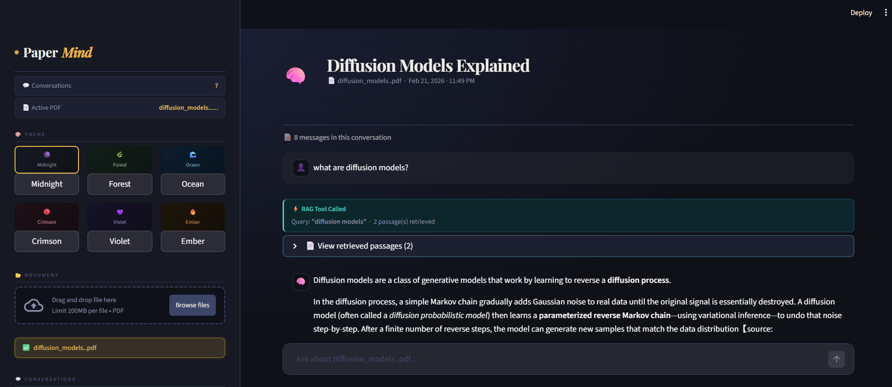

# PaperMind RAG Chatbot

A simple RAG (Retrieval-Augmented Generation) chatbot built with Streamlit and LangGraph.

## Files Overview

### rag_backend.py

Core backend logic implementing:

- **LangGraph StateGraph** for conversation management
- **FAISS vector store** for document embeddings and retrieval
- **Groq LLM integration** for AI responses
- **SQLite persistence** for conversation history
- **PDF processing** with PyPDFLoader and text chunking

Key features:

- RAG tool for document-based Q&A
- Smart message trimming to prevent context overflow
- Thread management with metadata storage
- Persistent FAISS indexes for fast document retrieval

### rag_frontend.py

Streamlit-based frontend with:

- **6 beautiful themes**: Midnight, Forest, Ocean, Crimson, Violet, Ember
- **PDF upload interface** for document processing
- **Real-time chat interface** with conversation history
- **Thread management** for organizing multiple conversations
- **Auto-naming** of conversations based on first message

## Quick Start

1. Install dependencies:

```bash
pip install streamlit langchain langgraph faiss-cpu
```

2. Run the frontend:

```bash
streamlit run rag_frontend.py
```

3. Open your browser to `http://localhost:8501`

## Usage

1. **Upload a PDF** in the sidebar
2. **Ask questions** about the document content
3. **View retrieved passages** that the AI used for answers
4. **Switch between conversations** using the thread list
5. **Change themes** from the sidebar theme selector

## Screenshots

### Main Chat Interface





## Technical Details

- **Backend**: Python with LangGraph for state management
- **Frontend**: Streamlit with custom CSS theming
- **Database**: SQLite for conversation persistence
- **Vector Store**: FAISS for document embeddings
- **LLM**: Groq API integration
- **Embeddings**: Ollama with nomic-embed-text-v2-moe

## Dependencies

- streamlit
- langchain
- langgraph
- faiss-cpu
- groq
- ollama
- sqlite3
- PyPDF2

